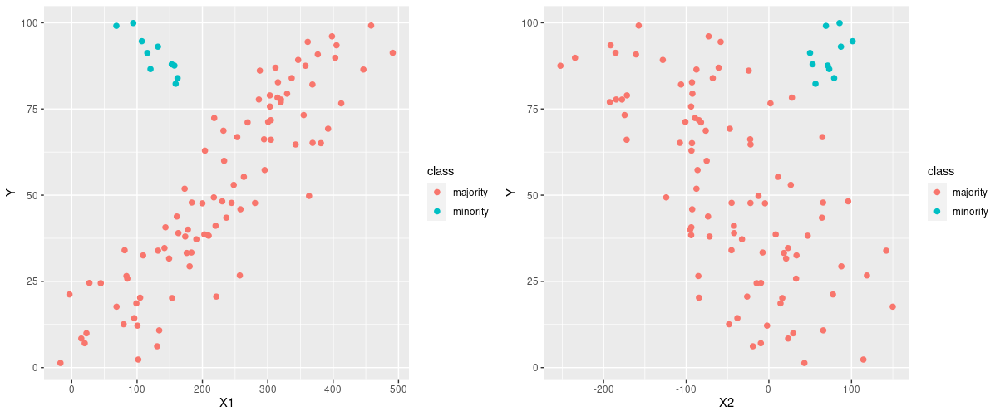
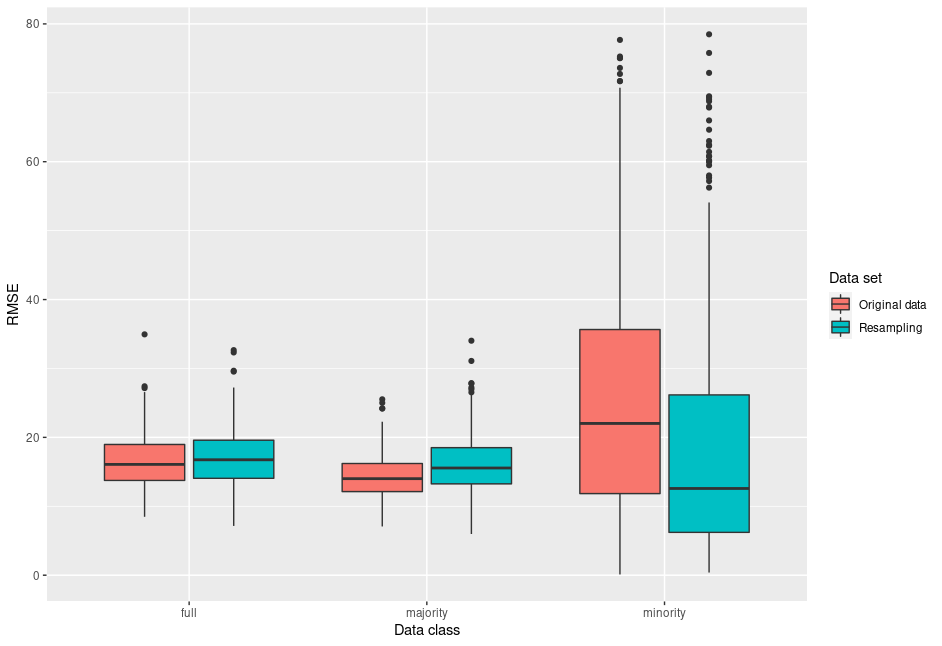

## Class imbalance in regression

Resampling from an imbalanced data set is a well known procedure to improve the accuracy of the minority class in a data classification application. This script shows, how resampling from a mixed population can alter the performance of a regression model.

A data set is created in which the target variable `Y` is explained by two informative (`X1`, `X2`) and one uninformative predictor (`X3`). The population exists of two subgroups with different relationships between response and predictors. Two random forest models are used to predict `Y`. The model using `Original data' uses all observations once, while the `Resampling' model forces a minority class frequency of 0.3 by repeated sampling of the minority class and undersampling of the majority class, while the total number of samples remains the same.

Format: 

Oversampling from the minority class can lead to a decreased RMSE in that class.

Format: 

Using 30 times 5 fold cross validation shows that the RMSE of the whole data (minority + majority) does not change between the two models. While the RMSE of the majority class increases slightly in the `Resampling' model, the RMSE of the minority class decreases substantially.
